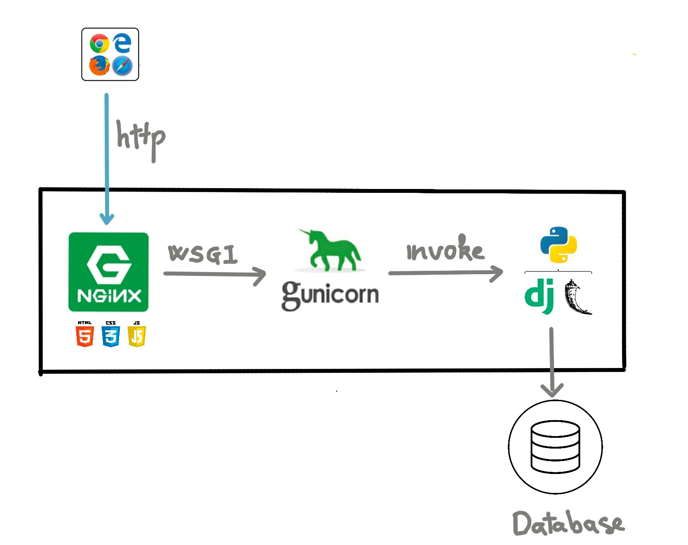
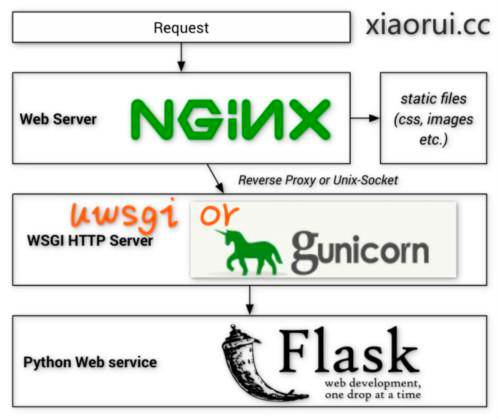
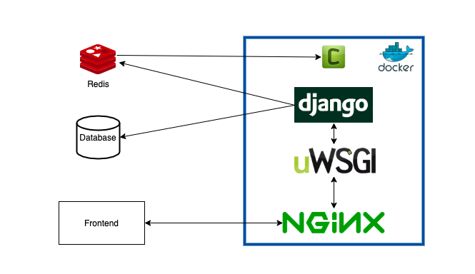

-------------------- 1

-------------------- 2
https://gunicorn.org/
gunicorn -w 4 myapp:app

-------------------- 3
cd src
gunicorn --chdir src -w 4 core.wsgi

export WSGI_PORT=8080
export PROJECT_DIR="~/github.com/romanitalian/bread_blog_celery"
gunicorn -w 4 -b 0.0.0.0:$WSGI_PORT --chdir $PROJECT_DIR/src core.wsgi --timeout 60 --log-level info --max-requests 10000

-------------------- 4

--timeout 10
sleep(15)

curl http://127.0.0.1:8080/posts/list/csv
curl: (52) Empty reply from server

-------------------- 5
gunicorn -w 1 -b 0.0.0.0:$(WSGI_PORT) --chdir $(PROJECT_DIR)/src core.wsgi --timeout 60 --log-level debug --max-requests 2

1 воркер
и --max-requests 2 - рестарт воркера после обработки 2-х запросов

terminal #1 curl http://127.0.0.1:8080/posts/list/csv
terminal #2 curl http://127.0.0.1:8080/posts/list/csv

[INFO] Autorestarting worker after current request.

-------------------- 6
https://www.digitalocean.com/community/tutorials/how-to-install-nginx-on-ubuntu-20-04

sudo apt install nginx

cat /usr/local/var/log/nginx/error.log

-------
server {
	listen 80;
	listen [::]:80;
	server_name _;
	location / {
		return 200;
	}
}
-------
server {
	listen 80 default_server;
	listen [::]:80 default_server;
	server_name 127.0.0.1 bread.com;

	location = /favicon.ico { access_log off; log_not_found off; }

	location / {
		proxy_pass http://127.0.0.1:8081;
	}
}

-------
server {
	listen 80 default_server;
	listen [::]:80 default_server;
	server_name 127.0.0.1 bread.com;

	location = /favicon.ico { access_log off; log_not_found off; }

	location /static/ {
		root /home/rmn/wks/src/github.com/romanitalian/bread_blog_celery/static_content;
	}

	location / {
		proxy_pass http://127.0.0.1:8081;
	}
}

-------
location / {
			include /usr/local/etc/nginx/uwsgi_params;
			uwsgi_pass django;
			uwsgi_param Host $host;
			uwsgi_param X-Real-IP $remote_addr;
			uwsgi_param X-Forwarded-For $proxy_add_x_forwarded_for;
			uwsgi_param X-Forwarded-Proto $http_x_forwarded_proto;
		}
-------
upstream django {
	server 127.0.0.1:8081;
	server 127.0.0.1:8082;
}
server {
	listen 80;
	listen [::]:80;
	server_name 127.0.0.1 bread.com;

	location = /favicon.ico { access_log off; log_not_found off; }

	location /static/ {
		root /home/rmn/wks/src/github.com/romanitalian/bread_blog_celery/static_content;
	}

	location / {
		proxy_pass http://django;
	}
}
-------
upstream django {
	server unix:/tmp/gunicorn.sock fail_timeout=0;
}
server {
	listen 80 default_server;
	listen [::]:80 default_server;
	server_name 127.0.0.1 bread.com;

	location = /favicon.ico { access_log off; log_not_found off; }

	location /static/ {
		root /home/rmn/wks/src/github.com/romanitalian/bread_blog_celery/static_content;
	}

	location / {
		proxy_pass http://django;
	}
}

sudo nginx -t
sudo service nginx restart

