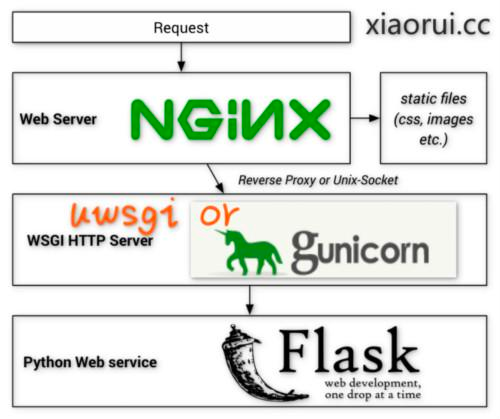
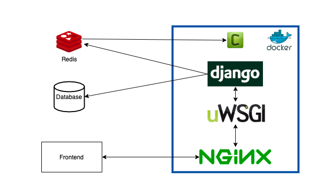
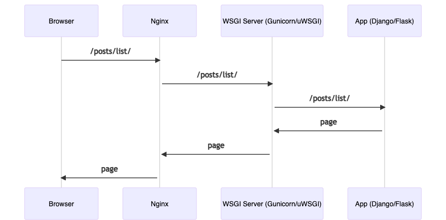

# 1 - Schema









# 2 - About Gunicorn
```shell
https://gunicorn.org/
gunicorn -w 4 myapp:app
```


# 3 - Run Gunicorn on our App
```shell
pip install gunicorn
cd src
gunicorn --chdir src -w 4 core.wsgi
```

```shell
export WSGI_PORT=8080
export PROJECT_DIR="~/github.com/romanitalian/bread_blog_celery"
gunicorn -w 4 -b 0.0.0.0:$WSGI_PORT --chdir $PROJECT_DIR/src core.wsgi --timeout 60 --log-level info --max-requests 10000

```
# 4 - Example of "timeout" worker

--timeout 10
sleep(15)

curl http://127.0.0.1:8080/posts/list/csv
curl: (52) Empty reply from server


# 5 - Example: auto restart worker after reaching the "max-requests"  
gunicorn -w 1 -b 0.0.0.0:$(WSGI_PORT) --chdir $(PROJECT_DIR)/src core.wsgi --timeout 60 --log-level debug --max-requests 2

1 воркер
и --max-requests 2 - рестарт воркера после обработки 2-х запросов


terminal #1 curl http://127.0.0.1:8080/posts/list/csv
terminal #2 curl http://127.0.0.1:8080/posts/list/csv


[INFO] Autorestarting worker after current request.

# 6 - Install Nginx
https://www.digitalocean.com/community/tutorials/how-to-install-nginx-on-ubuntu-20-04

sudo apt install nginx

cat /usr/local/var/log/nginx/error.log


mkdir -p /usr/local/etc/nginx/sites-{enabled,available}
cd /usr/local/etc/nginx/sites-enabled
ln -s ../sites-available/default.conf
ln -s ../sites-available/default-ssl.conf


(venv) (base) <rmn>local/etc/nginx : cat /usr/local/etc/nginx/nginx.conf
#user  nobody;
worker_processes  1;

error_log /usr/local/var/log/nginx/error.log;

events {
    worker_connections  1024;
}

http {
    include       mime.types;
    default_type  application/octet-stream;

    log_format  main  '$remote_addr - $remote_user [$time_local] "$request" '
                      '$status $body_bytes_sent "$http_referer" '
                      '"$http_user_agent" "$http_x_forwarded_for"';

    access_log  /usr/local/var/log/nginx/access.log  main;

    sendfile        on;

    keepalive_timeout  65;

    index index.html index.php;

    upstream www-upstream-pool{
        server unix:/tmp/php-fpm.sock;
    }

    include /etc/nginx/conf.d/*.conf;
    include /usr/local/etc/nginx/sites-enabled/*.conf;
}


-------
events {}
http {
	server {
		listen 80 default_server;
		listen [::]:80 default_server;
		server_name _;
		location / {
			return 200;
		}
	}
}
-------
events {}
http {
	server {
		listen 80 default_server;
		listen [::]:80 default_server;
		server_name 127.0.0.1 bread.com;

		location / {
			proxy_pass http://127.0.0.1:8081;
		}
	}
}

-------
events {}
http {
	server {
		listen 80;
		listen [::]:80;
		server_name 127.0.0.1 bread.com www.bread.com;

		location /static/ {
			root /Users/rmn/wks/src/github.com/romanitalian/bread_blog_celery/static_content;
		}

		location / {
			proxy_pass http://127.0.0.1:8081;
		}
	}
}

-------
location / {
			include /usr/local/etc/nginx/uwsgi_params;
			uwsgi_pass django;
			uwsgi_param Host $host;
			uwsgi_param X-Real-IP $remote_addr;
			uwsgi_param X-Forwarded-For $proxy_add_x_forwarded_for;
			uwsgi_param X-Forwarded-Proto $http_x_forwarded_proto;
		}
-------
events {}
http {
	upstream django {
		server 127.0.0.1:8081;
		server 127.0.0.1:8082;
	}

	server {
		listen 80;
		listen [::]:80;
		server_name 127.0.0.1 bread.com;

		location /static/ {
			root /Users/rmn/wks/src/github.com/romanitalian/bread_blog_celery/static_content;
		}

		location / {
			proxy_pass http://django;
		}
	}
}

-------
events {}
http {
	upstream django {
		server unix:/tmp/gunicorn.sock fail_timeout=0;
	}
	server {
		listen 80;
		listen [::]:80;
		server_name 127.0.0.1 bread.com;

		location = /favicon.ico { access_log off; log_not_found off; }

		location /static/ {
			root /Users/rmn/wks/src/github.com/romanitalian/bread_blog_celery/static_content;
		}

		location / {
			proxy_pass http://django;
		}
	}
}

sudo nginx -t
sudo brew services restart nginx

